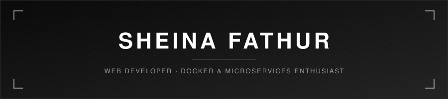
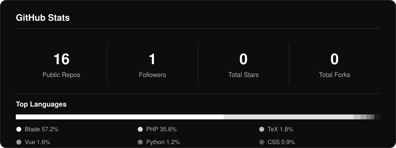
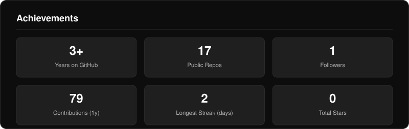
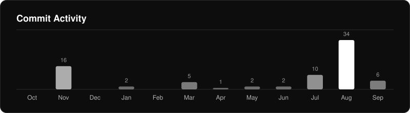
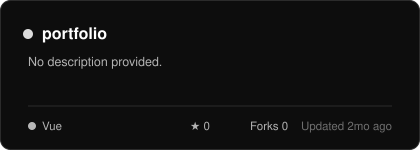
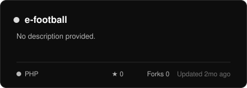
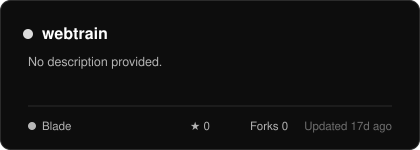
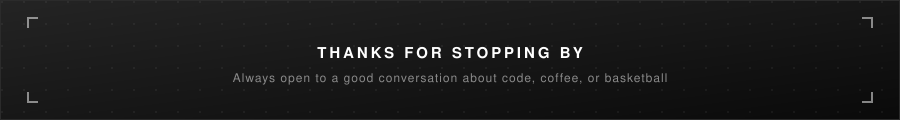

<div align="center">

<picture>
  <source media="(prefers-color-scheme: dark)" srcset="banner-dark.svg" />
  <source media="(prefers-color-scheme: light)" srcset="banner-light.svg" />
  
</picture>


<br/>

[](https://instagram.com/sheina.js)
[](https://linkedin.com/in/sheinafathurr1)
[](mailto:sheinafathur@gmail.com)

</div>

<div align="center">

<picture>
  <source media="(prefers-color-scheme: dark)" srcset="divider-dark.svg" />
  <source media="(prefers-color-scheme: light)" srcset="divider-light.svg" />
  
</picture>

</div>

## &nbsp;◆&nbsp; About Me

```yaml
role:      Web Developer
focus:     Docker & Microservices
mindset:   Lifelong Learner
currently: Building webtrain, polishing portfolio
contact:   sheinafathur@gmail.com
off_duty:  Basketball courts & sneaker hunting
```

<div align="center">

<picture>
  <source media="(prefers-color-scheme: dark)" srcset="divider-dark.svg" />
  <source media="(prefers-color-scheme: light)" srcset="divider-light.svg" />
  
</picture>

</div>

## &nbsp;◆&nbsp; Tech Stack

<table>
<tr>
<td valign="top" width="50%">

**Languages**


**Frontend**


</td>
<td valign="top" width="50%">

**Backend**


**Database**


**DevOps & Tools**


</td>
</tr>
</table>

<div align="center">

<picture>
  <source media="(prefers-color-scheme: dark)" srcset="divider-dark.svg" />
  <source media="(prefers-color-scheme: light)" srcset="divider-light.svg" />
  
</picture>

</div>

## &nbsp;◆&nbsp; GitHub Stats

<div align="center">

<picture>
  <source media="(prefers-color-scheme: dark)" srcset="stats-dark.svg" />
  <source media="(prefers-color-scheme: light)" srcset="stats-light.svg" />
  
</picture>

<picture>
  <source media="(prefers-color-scheme: dark)" srcset="achievements-dark.svg" />
  <source media="(prefers-color-scheme: light)" srcset="achievements-light.svg" />
  
</picture>

<picture>
  <source media="(prefers-color-scheme: dark)" srcset="https://streak-stats.demolab.com/?user=sheinafathurr1&hide_border=true&background=0D0D0D&border=2B2B2B&ring=FFFFFF&fire=FFFFFF&currStreakLabel=FFFFFF&currStreakNum=FFFFFF&sideLabels=B3B3B3&sideNums=FFFFFF&dates=808080" />
  <source media="(prefers-color-scheme: light)" srcset="https://streak-stats.demolab.com/?user=sheinafathurr1&hide_border=true&background=FFFFFF&border=D8D8D8&ring=0D0D0D&fire=0D0D0D&currStreakLabel=0D0D0D&currStreakNum=0D0D0D&sideLabels=4D4D4D&sideNums=0D0D0D&dates=8A8A8A" />
  
</picture>

<picture>
  <source media="(prefers-color-scheme: dark)" srcset="activity-dark.svg" />
  <source media="(prefers-color-scheme: light)" srcset="activity-light.svg" />
  
</picture>

</div>

<div align="center">

<picture>
  <source media="(prefers-color-scheme: dark)" srcset="divider-dark.svg" />
  <source media="(prefers-color-scheme: light)" srcset="divider-light.svg" />
  
</picture>

</div>

## &nbsp;◆&nbsp; Contribution Snake

<div align="center">

<picture>
  <source media="(prefers-color-scheme: dark)" srcset="https://raw.githubusercontent.com/sheinafathurr1/sheinafathurr1/output/snake-dark.svg" />
  <source media="(prefers-color-scheme: light)" srcset="https://raw.githubusercontent.com/sheinafathurr1/sheinafathurr1/output/snake-light.svg" />
  
</picture>

</div>

<div align="center">

<picture>
  <source media="(prefers-color-scheme: dark)" srcset="divider-dark.svg" />
  <source media="(prefers-color-scheme: light)" srcset="divider-light.svg" />
  
</picture>

</div>

## &nbsp;◆&nbsp; Pinned Projects

<div align="center">

<a href="https://github.com/sheinafathurr1/portfolio"><picture>
  <source media="(prefers-color-scheme: dark)" srcset="projects/portfolio-dark.svg" />
  <source media="(prefers-color-scheme: light)" srcset="projects/portfolio-light.svg" />
  
</picture></a>
<a href="https://github.com/sheinafathurr1/e-football"><picture>
  <source media="(prefers-color-scheme: dark)" srcset="projects/e-football-dark.svg" />
  <source media="(prefers-color-scheme: light)" srcset="projects/e-football-light.svg" />
  
</picture></a>
<br/>
<a href="https://github.com/sheinafathurr1/ideahub"><picture>
  <source media="(prefers-color-scheme: dark)" srcset="projects/ideahub-dark.svg" />
  <source media="(prefers-color-scheme: light)" srcset="projects/ideahub-light.svg" />
  
</picture></a>
<a href="https://github.com/sheinafathurr1/webtrain"><picture>
  <source media="(prefers-color-scheme: dark)" srcset="projects/webtrain-dark.svg" />
  <source media="(prefers-color-scheme: light)" srcset="projects/webtrain-light.svg" />
  
</picture></a>

</div>

<div align="center">

<picture>
  <source media="(prefers-color-scheme: dark)" srcset="divider-dark.svg" />
  <source media="(prefers-color-scheme: light)" srcset="divider-light.svg" />
  
</picture>

</div>

<div align="center">

<picture>
  <source media="(prefers-color-scheme: dark)" srcset="https://quotes-github-readme.vercel.app/api?type=horizontal&theme=dark" />
  <source media="(prefers-color-scheme: light)" srcset="https://quotes-github-readme.vercel.app/api?type=horizontal&theme=light" />
  
</picture>

</div>

<br/>

<div align="center">


<picture>
  <source media="(prefers-color-scheme: dark)" srcset="footer-dark.svg" />
  <source media="(prefers-color-scheme: light)" srcset="footer-light.svg" />
  
</picture>

</div>
